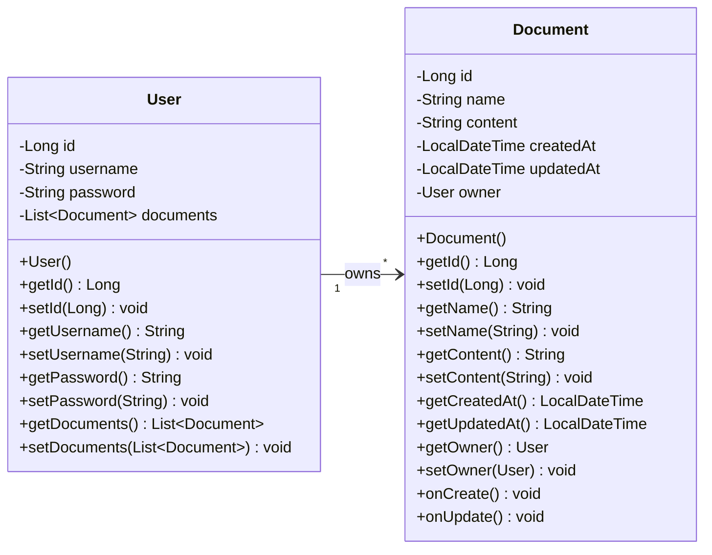
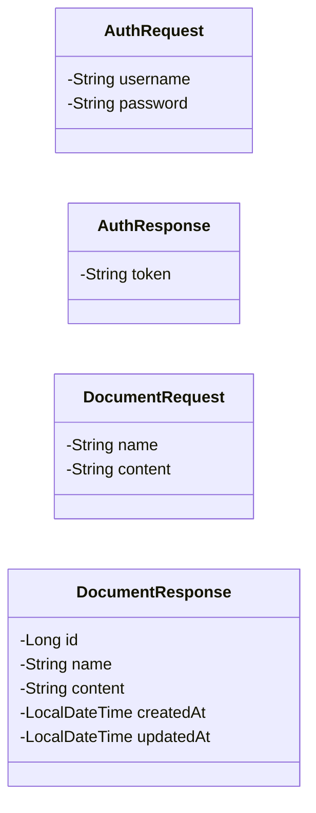
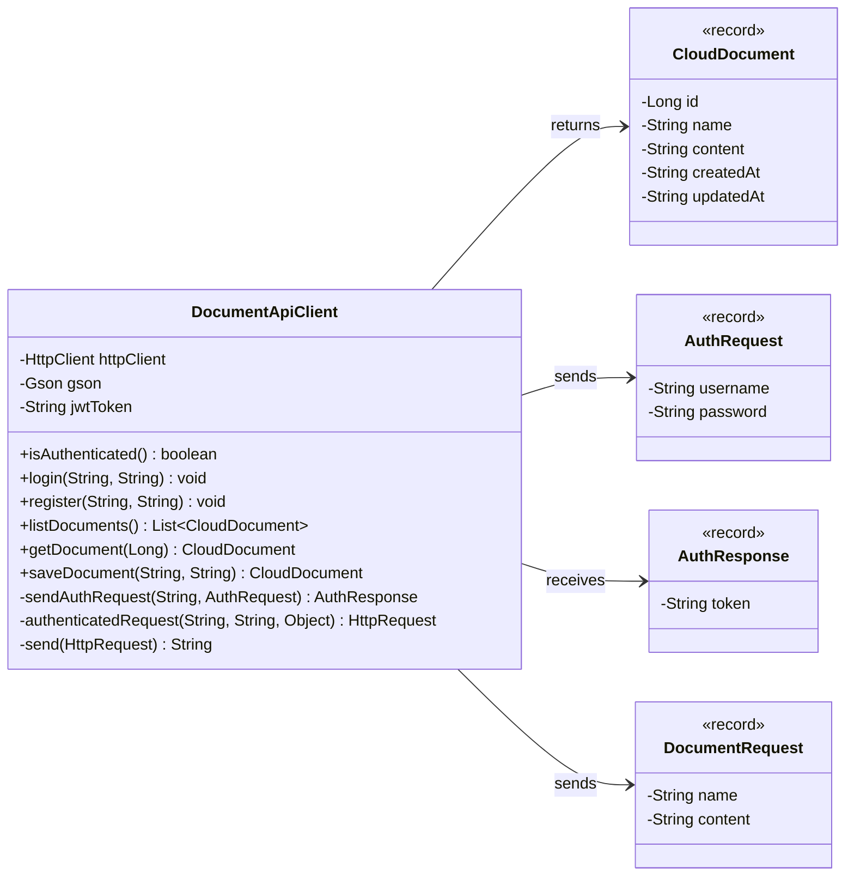
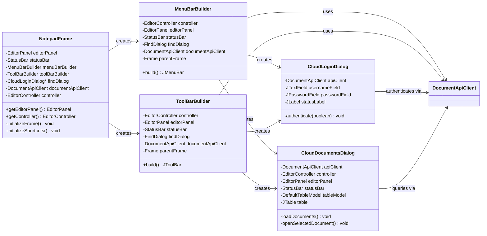
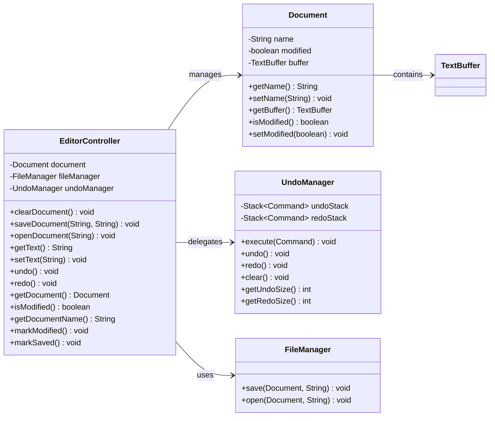

# UML Class Diagrams

## 1. Backend JPA Entity Model



## 2. Backend Service & Controller Layer

```mermaid
classDiagram
    direction LR
    
    class AuthController {
        -AuthService authService
        +register(AuthRequest) ResponseEntity~AuthResponse~
        +authenticate(AuthRequest) ResponseEntity~AuthResponse~
    }
    
    class DocumentController {
        -DocumentService documentService
        +listDocuments(Principal) ResponseEntity~List~DocumentResponse~~
        +getDocument(Long, Principal) ResponseEntity~DocumentResponse~
        +createDocument(DocumentRequest, Principal) ResponseEntity~DocumentResponse~
        +updateDocument(Long, DocumentRequest, Principal) ResponseEntity~DocumentResponse~
        +deleteDocument(Long, Principal) ResponseEntity~Void~
    }
    
    class AuthService {
        -UserRepository repository
        -PasswordEncoder passwordEncoder
        -JwtService jwtService
        -AuthenticationManager authenticationManager
        +register(AuthRequest) AuthResponse
        +authenticate(AuthRequest) AuthResponse
    }
    
    class DocumentService {
        -DocumentRepository documentRepository
        -UserRepository userRepository
        +listDocuments(String) List~DocumentResponse~
        +getDocument(Long, String) DocumentResponse
        +createDocument(DocumentRequest, String) DocumentResponse
        +updateDocument(Long, DocumentRequest, String) DocumentResponse
        +deleteDocument(Long, String) void
        -findUser(String) User
        -mapToResponse(Document) DocumentResponse
    }
    
    class JwtService {
        -String secretKey
        -long jwtExpiration
        +extractUsername(String) String
        +generateToken(UserDetails) String
        +isTokenValid(String, UserDetails) boolean
        -isTokenExpired(String) boolean
        -extractExpiration(String) Date
        -extractAllClaims(String) Claims
        -getSignInKey() Key
    }
    
    AuthController --> AuthService : uses
    DocumentController --> DocumentService : uses
    AuthService --> JwtService : uses
    DocumentService --> "UserRepository & DocumentRepository" : queries
```

## 3. Backend Repository Interfaces

```mermaid
classDiagram
    direction LR
    
    class UserRepository {
        <<interface>>
        +findByUsername(String) Optional~User~
    }
    
    class DocumentRepository {
        <<interface>>
        +findByOwnerId(Long) List~Document~
        +findByIdAndOwnerId(Long, Long) Optional~Document~
    }
    
    UserRepository --|> "JpaRepository~User, Long~" : extends
    DocumentRepository --|> "JpaRepository~Document, Long~" : extends
```

## 4. Backend DTO Model



## 5. Client HTTP API Client



## 6. Client UI & Dialog Layer



## 7. Client Application Context (IoC)

```mermaid
classDiagram
    direction LR
    
    class ApplicationContext {
        -BeanFactory factory
        -BeanRegistry registry
        +ApplicationContext()
        +getBean(Class~T~) T
        -initializeBeans() void
    }
    
    class BeanFactory {
        +createEventManager() EventManager
        +createUndoManager() UndoManager
        +createFileManager() FileManager
        +createDocumentApiClient() DocumentApiClient
        +createDocument(EventManager) Document
    }
    
    class BeanRegistry {
        -Map~Class, Object~ beans
        +register(Class~T~, T) void
        +get(Class~T~) T
    }
    
    ApplicationContext --> BeanFactory : uses
    ApplicationContext --> BeanRegistry : uses
    BeanFactory --> "EventManager, UndoManager, FileManager, DocumentApiClient, Document" : creates
    BeanRegistry --> "EventManager, UndoManager, FileManager, DocumentApiClient, Document" : stores
```

## 8. Client Controller & Model


