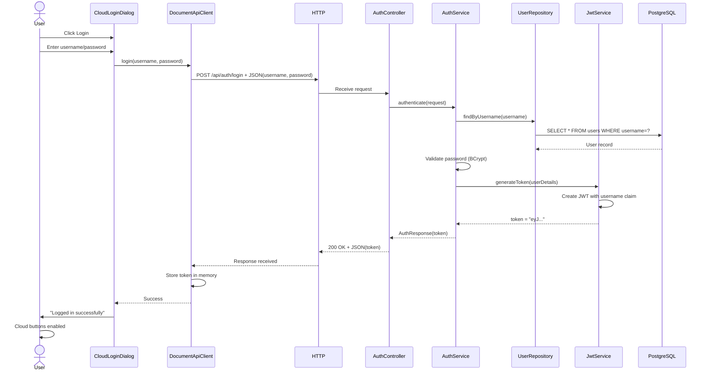
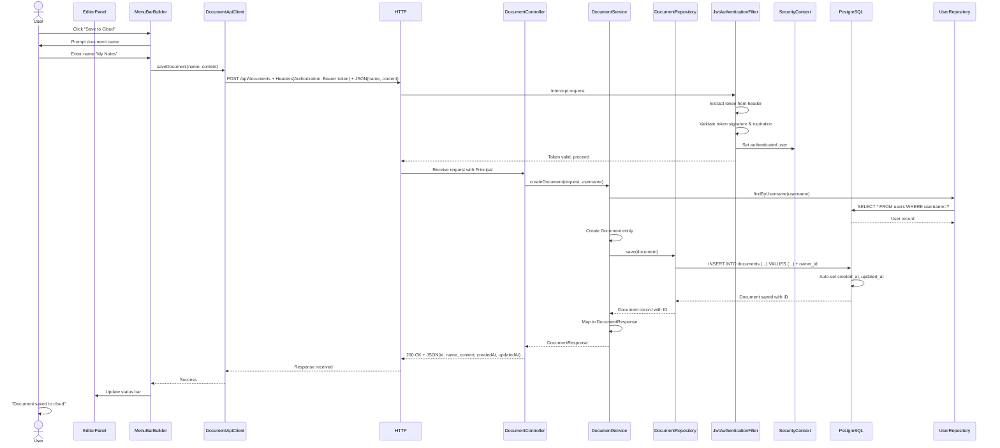
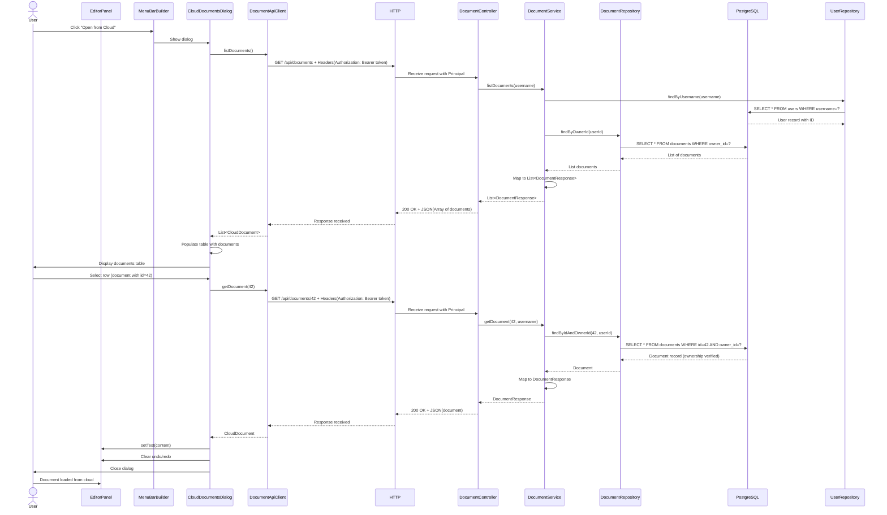

# UML Sequence Diagrams

## 1. Cloud Authentication Flow

```mermaid
sequenceDiagram
    actor User
    participant CloudLoginDialog
    participant DocumentApiClient
    participant HTTP
    participant AuthController
    participant AuthService
    participant UserRepository
    participant JwtService
    participant PostgreSQL

    User->>CloudLoginDialog: Click Login
    User->>CloudLoginDialog: Enter username/password
    CloudLoginDialog->>DocumentApiClient: login(username, password)
    DocumentApiClient->>HTTP: POST /api/auth/login + JSON(username, password)
    HTTP->>AuthController: Receive request
    AuthController->>AuthService: authenticate(request)
    AuthService->>UserRepository: findByUsername(username)
    UserRepository->>PostgreSQL: SELECT * FROM users WHERE username=?
    PostgreSQL-->>UserRepository: User record
    AuthService->>AuthService: Validate password (BCrypt)
    AuthService->>JwtService: generateToken(userDetails)
    JwtService->>JwtService: Create JWT with username claim
    JwtService-->>AuthService: token = "eyJ..."
    AuthService-->>AuthController: AuthResponse(token)
    AuthController-->>HTTP: 200 OK + JSON(token)
    HTTP-->>DocumentApiClient: Response received
    DocumentApiClient->>DocumentApiClient: Store token in memory
    DocumentApiClient-->>CloudLoginDialog: Success
    CloudLoginDialog->>User: "Logged in successfully"
    User->>User: Cloud buttons enabled
```

## 2. Cloud Document Save Flow

```mermaid
sequenceDiagram
    actor User
    participant EditorPanel
    participant MenuBarBuilder
    participant DocumentApiClient
    participant HTTP
    participant DocumentController
    participant DocumentService
    participant DocumentRepository
    participant JwtAuthenticationFilter
    participant SecurityContext
    participant PostgreSQL

    User->>MenuBarBuilder: Click "Save to Cloud"
    MenuBarBuilder->>User: Prompt document name
    User->>MenuBarBuilder: Enter name "My Notes"
    MenuBarBuilder->>DocumentApiClient: saveDocument(name, content)
    DocumentApiClient->>HTTP: POST /api/documents + Headers(Authorization: Bearer token) + JSON(name, content)
    HTTP->>JwtAuthenticationFilter: Intercept request
    JwtAuthenticationFilter->>JwtAuthenticationFilter: Extract token from header
    JwtAuthenticationFilter->>JwtAuthenticationFilter: Validate token signature & expiration
    JwtAuthenticationFilter->>SecurityContext: Set authenticated user
    JwtAuthenticationFilter-->>HTTP: Token valid, proceed
    HTTP->>DocumentController: Receive request with Principal
    DocumentController->>DocumentService: createDocument(request, username)
    DocumentService->>UserRepository: findByUsername(username)
    UserRepository->>PostgreSQL: SELECT * FROM users WHERE username=?
    PostgreSQL-->>UserRepository: User record
    DocumentService->>DocumentService: Create Document entity
    DocumentService->>DocumentRepository: save(document)
    DocumentRepository->>PostgreSQL: INSERT INTO documents (...) VALUES (...) + owner_id
    PostgreSQL->>PostgreSQL: Auto-set created_at, updated_at
    PostgreSQL-->>DocumentRepository: Document saved with ID
    DocumentRepository-->>DocumentService: Document record with ID
    DocumentService->>DocumentService: Map to DocumentResponse
    DocumentService-->>DocumentController: DocumentResponse
    DocumentController-->>HTTP: 200 OK + JSON(id, name, content, createdAt, updatedAt)
    HTTP-->>DocumentApiClient: Response received
    DocumentApiClient-->>MenuBarBuilder: Success
    MenuBarBuilder->>EditorPanel: Update status bar
    User->>User: "Document saved to cloud"
```

## 3. Cloud Document Open Flow

```mermaid
sequenceDiagram
    actor User
    participant EditorPanel
    participant MenuBarBuilder
    participant CloudDocumentsDialog
    participant DocumentApiClient
    participant HTTP
    participant DocumentController
    participant DocumentService
    participant DocumentRepository
    participant PostgreSQL

    User->>MenuBarBuilder: Click "Open from Cloud"
    MenuBarBuilder->>CloudDocumentsDialog: Show dialog
    CloudDocumentsDialog->>DocumentApiClient: listDocuments()
    DocumentApiClient->>HTTP: GET /api/documents + Headers(Authorization: Bearer token)
    HTTP->>DocumentController: Receive request with Principal
    DocumentController->>DocumentService: listDocuments(username)
    DocumentService->>UserRepository: findByUsername(username)
    UserRepository->>PostgreSQL: SELECT * FROM users WHERE username=?
    PostgreSQL-->>UserRepository: User record with ID
    DocumentService->>DocumentRepository: findByOwnerId(userId)
    DocumentRepository->>PostgreSQL: SELECT * FROM documents WHERE owner_id=?
    PostgreSQL-->>DocumentRepository: List of documents
    DocumentRepository-->>DocumentService: List documents
    DocumentService->>DocumentService: Map to List<DocumentResponse>
    DocumentService-->>DocumentController: List<DocumentResponse>
    DocumentController-->>HTTP: 200 OK + JSON(Array of documents)
    HTTP-->>DocumentApiClient: Response received
    DocumentApiClient-->>CloudDocumentsDialog: List<CloudDocument>
    CloudDocumentsDialog->>CloudDocumentsDialog: Populate table with documents
    CloudDocumentsDialog->>User: Display documents table
    User->>CloudDocumentsDialog: Select row (document with id=42)
    CloudDocumentsDialog->>DocumentApiClient: getDocument(42)
    DocumentApiClient->>HTTP: GET /api/documents/42 + Headers(Authorization: Bearer token)
    HTTP->>DocumentController: Receive request with Principal
    DocumentController->>DocumentService: getDocument(42, username)
    DocumentService->>DocumentRepository: findByIdAndOwnerId(42, userId)
    DocumentRepository->>PostgreSQL: SELECT * FROM documents WHERE id=42 AND owner_id=?
    PostgreSQL-->>DocumentRepository: Document record (ownership verified)
    DocumentRepository-->>DocumentService: Document
    DocumentService->>DocumentService: Map to DocumentResponse
    DocumentService-->>DocumentController: DocumentResponse
    DocumentController-->>HTTP: 200 OK + JSON(document)
    HTTP-->>DocumentApiClient: Response received
    DocumentApiClient-->>CloudDocumentsDialog: CloudDocument
    CloudDocumentsDialog->>EditorPanel: setText(content)
    CloudDocumentsDialog->>EditorPanel: Clear undo/redo
    CloudDocumentsDialog->>User: Close dialog
    User->>EditorPanel: Document loaded from cloud
```
